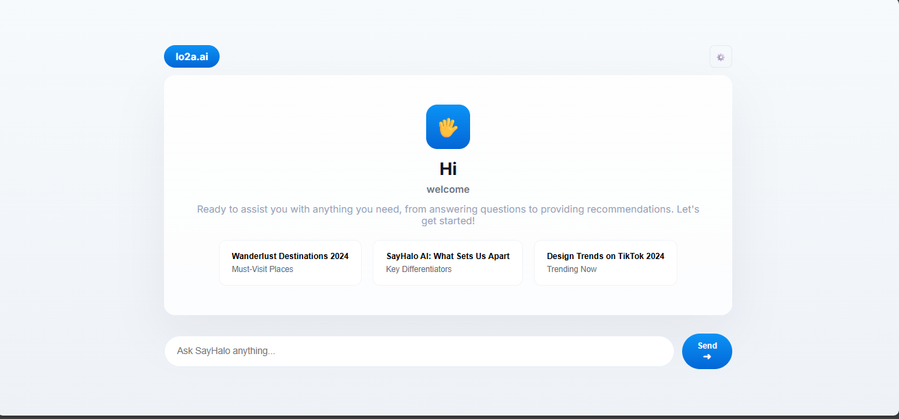

# AI Agent Chat

A lightweight local/web agent that uses Hugging Face models via the Inference Router (or a local Transformers pipeline fallback). This repository provides:

- A Flask web UI (`templates/index.html`) for chat.
- An agent backend (`app.py`) with several utility tools exposed to the agent (calculator, todo manager, unit converter, palindrome checker, random generator, text reverser, regex helper, JSON validator, base64).
- A small UI that polls `/status` and sends chat messages to `/chat`.

## Features

- Remote model support: uses Hugging Face Inference Router (model `openai/gpt-oss-120b`) when `HF_TOKEN` is provided.
- Local fallback: uses a local small model (`distilgpt2`) via `transformers.pipeline` when remote access is not configured.
- Multiple utility tools registered as `@tool` for agent usage.
- Simple, responsive web UI with animated hero and status indicator.

## Quick Start

Prerequisites

- Python 3.11+ (project lists >=3.13 in `pyproject.toml`; 3.11–3.13 should work)
- A Hugging Face token (`HF_TOKEN`) if you plan to use the hosted `gpt-oss-120b` model (recommended for fast startup).

Install dependencies (recommended inside a venv):

```powershell
python -m venv .venv
.\.venv\Scripts\Activate.ps1
pip install -r requirements.txt
```

(If `requirements.txt` is not present, install from `pyproject.toml` dependencies or run:)

```powershell
pip install langchain langchain-openai langgraph python-dotenv flask transformers torch langchain-huggingface requests openai
```

Configure environment variables

- Option A — create `.env` in the repo root with:

```text
HF_TOKEN=hf_...your_token_here
```

- Option B — set the variable for the session:

```powershell
$env:HF_TOKEN = 'hf_...'
python app.py
```

Run the app

```powershell
python app.py
```

Open http://127.0.0.1:8080 in your browser.

## How it works (file by file)

- `app.py`
  - Starts a Flask app serving `templates/index.html`.
  - Defines a bunch of `@tool` functions (calculator, todo_manager, unit_converter, palindrome_checker, random_number_generator, text_reverser, regex_tool, json_validator, base64_tool) that the agent can call.
  - `load_model_background()` runs in a background thread and:
    - If `HF_TOKEN` exists, it initialises an `OpenAI`-compatible client pointed to `https://router.huggingface.co/v1` and uses the remote model `openai/gpt-oss-120b`.
    - Otherwise, it falls back to `transformers.pipeline('text-generation', model='distilgpt2')` and wraps it with a small adapter.
  - Exposes `/chat` which accepts POST JSON {message: '...'} and returns the aggregated agent response.
  - Exposes `/status` returning JSON with `ready` and `loading` booleans for the UI to poll.

- `templates/index.html`
  - A single-page chat UI. Polls `/status` every 2s and enables input when ready.
  - Sends messages to `/chat` and displays responses in the chat window.
  - Minimal CSS and JS; easy to extend.

- `pyproject.toml`
  - Lists project dependencies and metadata.

- `.env` (optional)
  - When present with `HF_TOKEN`, the app will attempt to use the Hugging Face Inference Router for `openai/gpt-oss-120b`.

## Recommendations / Notes

- For fast, production-like responses use the Hugging Face hosted model via `HF_TOKEN`. Local models will require downloading weights and more memory.
- If you want to use a different remote model, change the `model_name` in `app.py`'s `HFAdapterRemote` initialization.
- Consider adding rate-limiting / authentication for `/chat` when exposing publicly.

## Animated Demo

The repository includes a small SVG at `assets/demo.svg` used in this README to show the chat hero with subtle motion. You can replace it with a GIF if you prefer.

## Troubleshooting

- "ModuleNotFoundError: No module named 'flask'": Ensure dependencies are installed in your active Python environment.
- Model loading slow: provide a valid `HF_TOKEN` to use the hosted `gpt-oss-120b` model, or change the local fallback to an even smaller model like `gpt2`.

## Contributing

Contributions welcome. Open an issue or PR with focused changes. Keep UI and backend responsibilities separated.

## License

MIT

## Design — Hero UI

The project now includes a centered "Hero" landing UI that serves as the primary entry point for users. It features:

- A large greeting with a compact avatar and short subtitle.
- A short descriptive note and three suggestion cards (click any card to send its prompt).
- A rounded bottom input bar with a prominent send button for quick queries.
- Responsive layout that adapts to narrow screens and maintains a clean, minimal look.

Screenshot (replace this file with your preferred capture):



To update the screenshot used above, copy your PNG or JPG into `assets/demo.png` and commit it to the repo. The README will render the image automatically on GitHub.

If you'd like I can embed an animated preview GIF or add a small walkthrough showing the suggestion-card interactions and how messages are sent to `/chat`.
